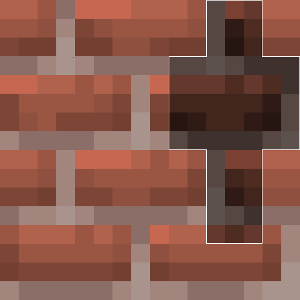
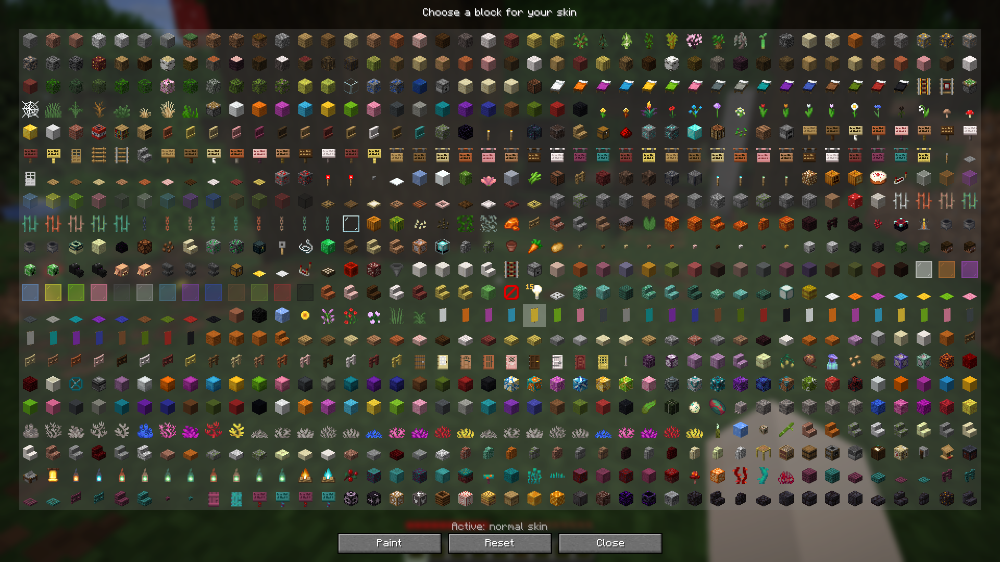
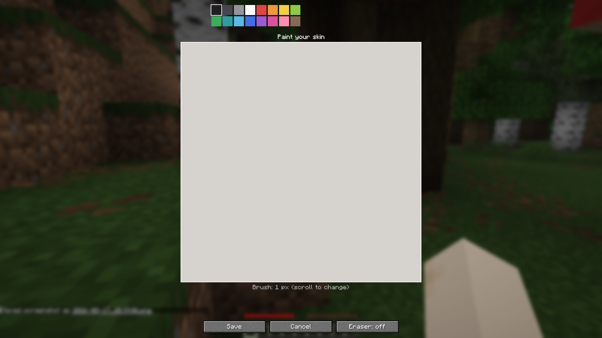

<p align="center">
  
</p>

<h1 align="center">MakeMeABlock</h1>

Become a block in Minecraft! Press **B** to open the block picker, choose any block to wear as your skin — or paint your own custom skin, pixel by pixel.

A client-side Fabric mod for Minecraft **26.2**.

## Screenshots





## Features

- **Block skin** — pick any block from the picker and your player skin becomes that block, rendered on your avatar and first-person arms
- **Skin painter** — a built-in editor with a 16-color palette, adjustable brush size and an eraser
- **Block tinting** — grass, leaves and other tinted blocks are rendered with their natural colors
- **Reset anytime** — switch back to your normal skin with one click

## Requirements

- Minecraft **26.2**
- [Fabric Loader](https://fabricmc.net/use/installer/) **>= 0.19.3**
- [Fabric API](https://modrinth.com/mod/fabric-api) (any version for 26.2)
- Java **25** (bundled with the Fabric launcher)

## Installation

1. Install Fabric Loader for Minecraft 26.2
2. Put Fabric API and `makemeablock-<version>.jar` into your `mods` folder
3. Launch the game and press **B** (configurable in Controls → Make Me A Block)

## Usage

| Key | Action |
| --- | --- |
| `B` | Open the block picker |

- Click a block to apply it as your skin
- **Paint** opens the editor — draw with the palette, right-click (or eraser) to erase, scroll to change brush size
- **Reset** restores your normal skin

## Building from source

Requires JDK 25.

```bash
./gradlew build
```

The jar will be at `build/libs/makemeablock-<version>.jar`.

## License

[MIT](LICENSE) © 2026 Forki303